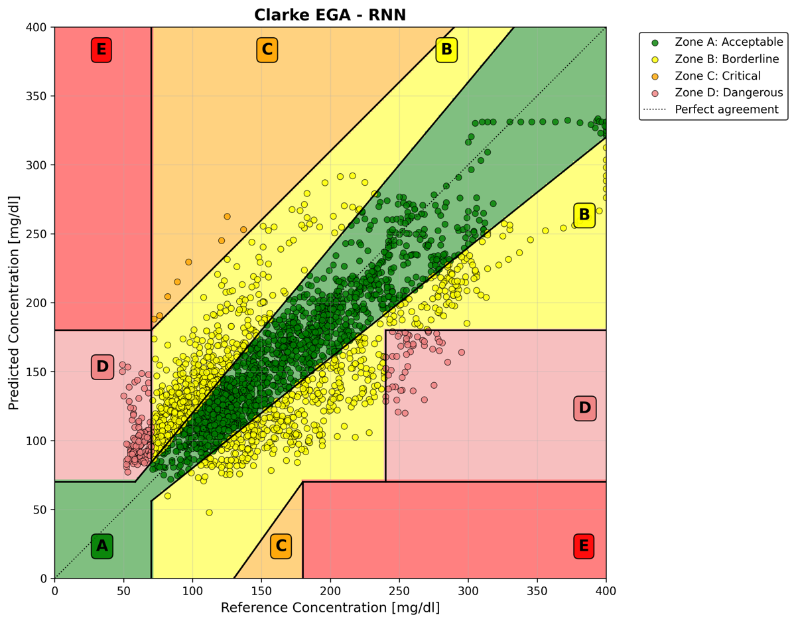
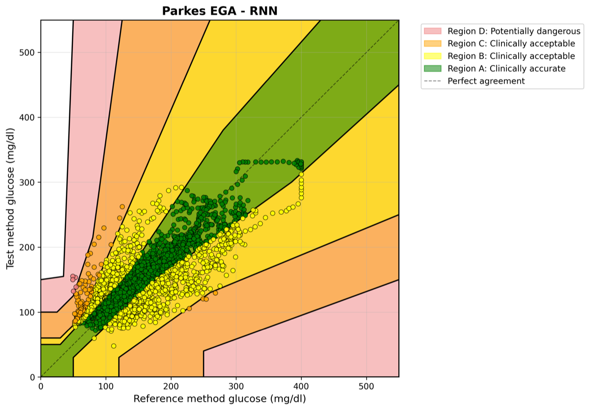
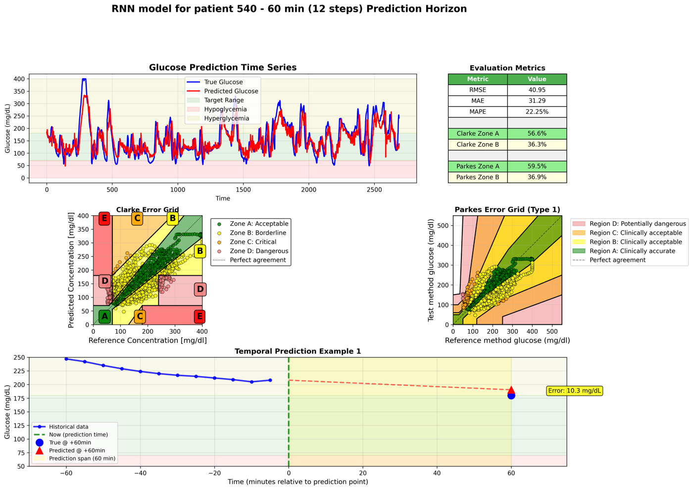
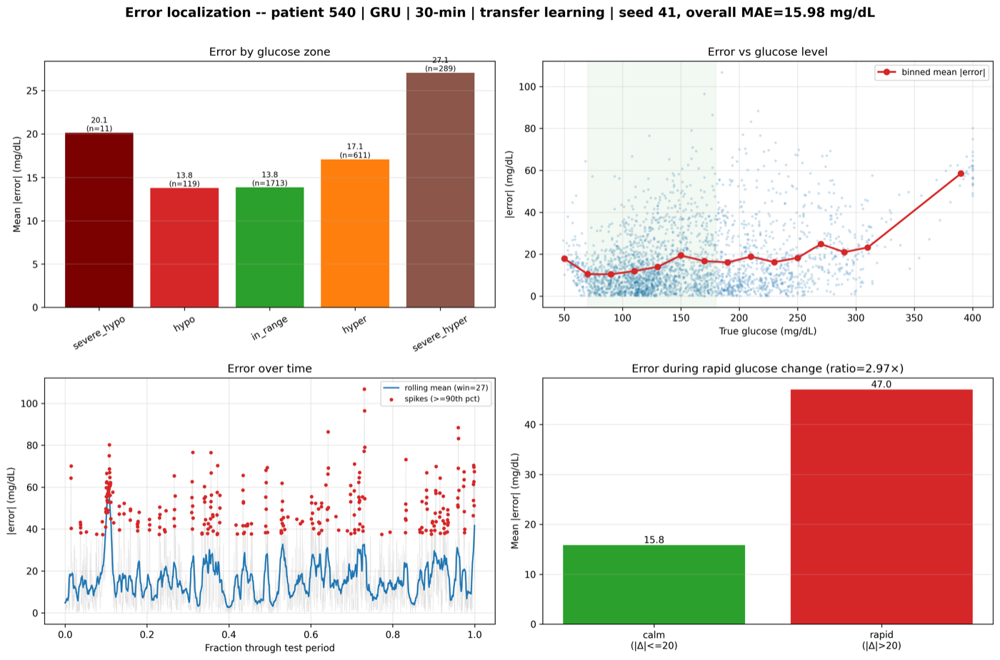
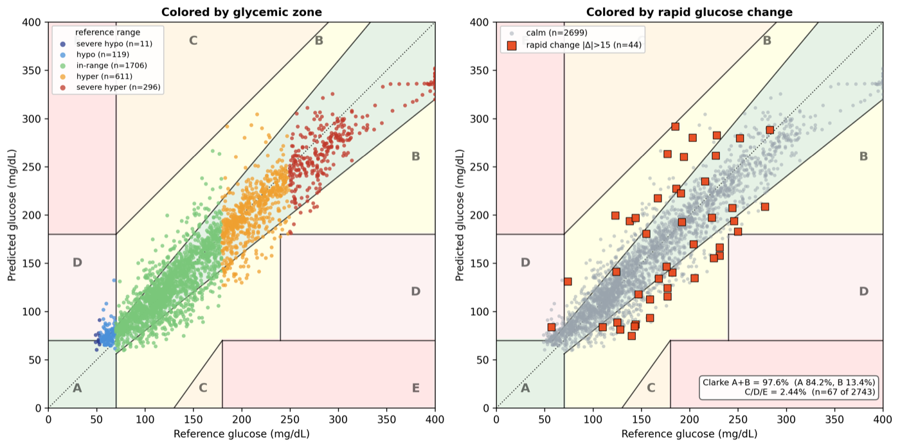
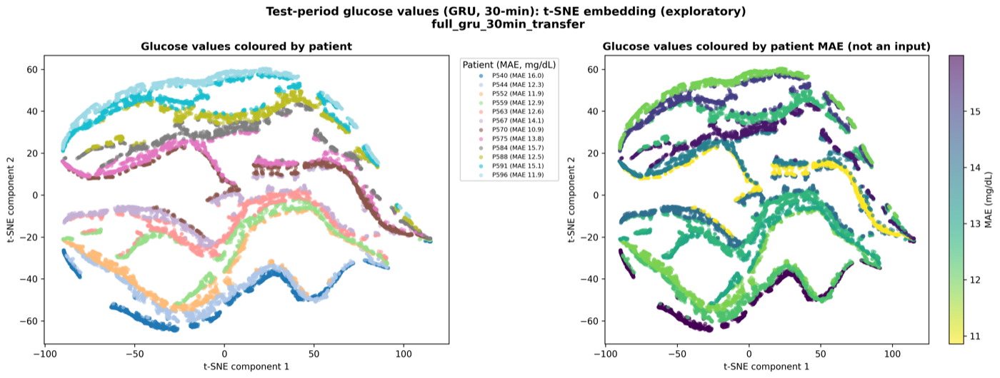
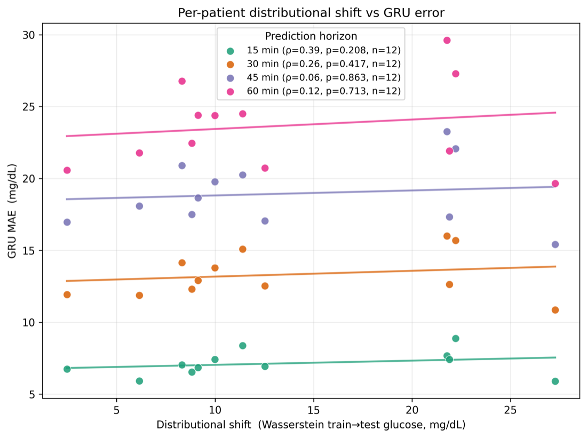
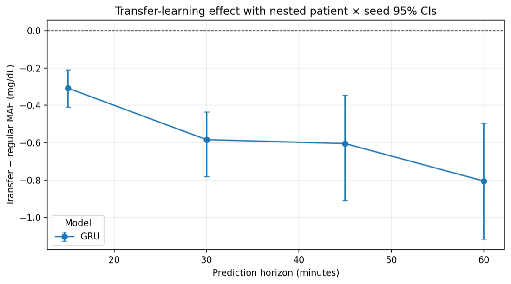

# Figures

Every figure this repository produces, with examples.

The images below are illustrative outputs of a real run on OhioT1DM, downscaled for
the web and committed under `docs/figures/`. They are **not** committed results:
`results/` is gitignored, and nothing in `docs/` is read by any analysis. Regenerate
the real thing from your own runs with the commands given under each figure.

All output is PNG. Per-patient and paper figures are written at 300 dpi; the
cohort-level line and error-bar plots at 200 dpi. No code path writes PDF or SVG —
`stage_glycemic` rejects a paired PDF explicitly ("at 12 cells x 12 patients a paired
PDF doubles the output for a raster figure nobody typesets from"). The PDFs in the
repository (`STRUCTURE_OVERVIEW.pdf`, the error-grid `README.pdf`s) are checked-in
documents, not generated.

---

## Written by a training run

These appear once per patient, per seed, per training mode, in
`<experiment>/<mode>/seed_<n>/patient_<id>/`, and only when the config sets
`output.generate_plots: true`. The two error grids additionally require
`clarke_ega` / `parkes_ega` to be listed under `evaluation.metrics`.

### `<MODEL>_clarke_ega.png` — Clarke error grid



Predicted against reference glucose over the patient's whole test period, on the
Clarke zones A-E. Drawn by `ClarkeEGA.plot` through
`benchmark/evaluation/visualisation.py::plot_clarke_analysis`, which excludes pairs
outside the 0-400 mg/dL grid domain and annotates how many it dropped.

### `<MODEL>_parkes_ega.png` — Parkes error grid



The same pairs on the Parkes (consensus) grid, regions A-E, Type 1 boundaries, over a
0-550 mg/dL domain. Drawn by `ParkesEGA.plot` through `plot_parkes_analysis`.

### `<MODEL>_dashboard.png` — prediction dashboard



One page per patient: the predicted-versus-true glucose trace over the test period,
a metrics panel (RMSE, MAE, MAPE, Clarke A/B, Parkes A/B), both error grids side by
side, and worked single-window examples showing the input history, the forecast at
+H minutes, and the error at that point. Drawn by
`visualisation.py::create_prediction_dashboard`.

```bash
bg-forecast run --config configs/full_gru_30min.yaml   # any config with generate_plots: true
```

---

## Written by the analysis stages

Produced by `RUN/run_experiments_analysis.sh <stage>` over runs that have already been
trained and recorded in `results/full_run_logs/parents.txt`.

### `error_localization_patient<ID>_<MODEL>.png` — where the error lives



Four panels for one patient: mean absolute error by glycemic zone (severe hypo, hypo,
in-range, hyper, severe hyper) with point counts; absolute error against reference
glucose with a fixed-width binned mean; absolute error through the test period as a
rolling mean with the spikes at or above the 90th percentile marked; and calm versus
rapid glucose change with their ratio. `--style both` additionally writes
`error_localization_patient<ID>_<MODEL>_benchmark.png`, a denser variant that splits
error magnitude from signed error direction.

```bash
bash RUN/run_experiments_analysis.sh figures
FIGURE_PATIENTS="540 584" FIGURE_MODE=regular bash RUN/run_experiments_analysis.sh figures
```

### `clarke_localized_patient<ID>_<MODEL>.png` — the Clarke grid, split two ways



The same Clarke grid drawn twice for one patient: coloured by the reference glycemic
range on the left, and by whether the point sits in a rapid glucose change on the
right, with the A+B and C/D/E shares quoted. Drawn over `ClarkeEGA.draw_localized_grid`,
a faint version of the grid so the points dominate. The `glycemic` stage writes this
single-seed form (`FIGURE_SEED`, default 41); the `figures` stage writes the
pooled-seed form as `clarke_localized_pooled_patient<ID>_<MODEL>.png`.

```bash
bash RUN/run_experiments_analysis.sh glycemic
```

### `tsne_test_<MODEL>.png` — test-period glucose embedding



t-SNE of the test-period glucose windows, coloured by patient on the left and by that
patient's MAE on the right. MAE is not an input to the embedding; it is painted on
afterwards, which is what makes the right-hand panel readable as a claim. Exploratory
only. Drawn once, for the `FIGURE_MODEL` / `FIGURE_HORIZON` cell.

```bash
bash RUN/run_experiments_analysis.sh tsne
```

### `shift_vs_mae_<MODEL>_<mode>.png` — does train-to-test shift predict difficulty?



One point per patient per horizon: Wasserstein train-to-test glucose shift against
that patient's MAE, with a per-horizon trend line and Spearman rho. A faceted
companion, `shift_vs_mae_<MODEL>_<mode>_faceted.png`, gives each horizon its own panel
with within-horizon Pearson and Spearman. The inference behind these plots — why the
patient is the independent unit, and the permutation scheme — is in
[`SHIFT_DIFFICULTY_INFERENCE.md`](../SHIFT_DIFFICULTY_INFERENCE.md).

```bash
bash RUN/run_dataset_analysis.sh      # writes dataset_signal_features.csv first
bash RUN/run_experiments_analysis.sh shift
```

### `transfer_inference.png` — transfer learning versus regular learning



The paired TL-RL MAE difference by horizon, with nested patient x seed 95% bootstrap
intervals. Below zero means transfer helped.

```bash
bash RUN/run_experiments_analysis.sh transfer
```

---

## Catalogue

Every figure the code can emit.

| Filename | Drawn by | Produced by |
| --- | --- | --- |
| `<MODEL>_clarke_ega.png` | `evaluation/visualisation.py::plot_clarke_analysis` | a training run with `output.generate_plots: true` |
| `<MODEL>_parkes_ega.png` | `evaluation/visualisation.py::plot_parkes_analysis` | same |
| `<MODEL>_dashboard.png` | `evaluation/visualisation.py::create_prediction_dashboard` | same |
| `error_localization_patient<ID>_<MODEL>.png` | `analysis/experiments/error_localization.py::plot_error_localization_paper` | `figures` stage |
| `error_localization_patient<ID>_<MODEL>_benchmark.png` | `…::plot_error_localization` | `figures` stage, `--style both` only |
| `clarke_localized_pooled_patient<ID>_<MODEL>.png` | `…::plot_clarke_localized` | `figures` stage |
| `clarke_localized_patient<ID>_<MODEL>.png` | `RUN/figures/run_clarke_localized_figure.py` | `glycemic` stage, seed `FIGURE_SEED` |
| `tsne_test_<MODEL>.png` | `analysis/experiments/patient_analysis.py::PatientAnalyzer.plot_glucose_tsne` | `tsne` stage |
| `shift_vs_mae_<MODEL>_<mode>.png` | `analysis/experiments/shift_mae_plot.py::plot_shift_vs_mae` | `shift` stage |
| `shift_vs_mae_<MODEL>_<mode>_faceted.png` | `…::plot_shift_vs_mae_faceted` | `shift` stage |
| `transfer_inference.png` | `analysis/experiments/transfer_inference.py::plot_transfer_inference` | `transfer` stage |
| `hard_easy_spread.png` | `analysis/experiments/patient_stability.py::plot_hard_easy_spread` | `stability` stage |
| `persistence_by_horizon.png` | `analysis/experiments/persistence.py::plot_persistence` | `persistence` stage |
| `rapid_change_localization.png` | `analysis/experiments/rapid_change.py::plot_rapid_change` | `rapid-change` stage |
| `population_glucose_overview.png` | `analysis/dataset/glucose_history.py::plot_population_glucose_overview` | `bash RUN/run_dataset_analysis.sh population` |
| `patient_tsne_<MODEL>.png`, `cluster_tsne_correlation_<MODEL>_<method>.png` | `PatientAnalyzer` | Python API only — no stage calls them |
| `train_test_glucose_comparison_<MODEL>.png` | `PopulationAnalysis.run_train_test_comparison` | Python API only |
| `boxplot_comparison.png` | `analysis/experiments/statistical_comparison.py::ExperimentComparator` | Python API only; `bg-forecast compare` writes JSON, not this |

The `zone-d` and `error-range` stages draw nothing — they write tables only.
`benchmark/utils/visualization.py` is a stub with no implementation; the plotting code
is in `benchmark/evaluation/visualisation.py` and under `benchmark/analysis/`.

## Where the numbers behind a figure live

Each figure is exported next to the table it was drawn from, so no caption claim is
left without a file behind it:

- `error_by_iso_band_<patient>_<model>.csv` — mean and signed error per glycemic band
- `error_by_condition_<patient>_<model>.csv` — calm versus rapid change
- `error_by_level_bin_<patient>_<model>.csv` — the binned means drawn over the scatter
- `clarke_zone_by_band_<patient>_<model>.csv` — the zone x band table behind the grid
- `figure_metadata_<patient>_<model>.json` — cell, seeds, thresholds, point counts

A band holding too few points to support a mean is drawn hatched and labelled with its
count rather than dropped, and flagged `interpretable=False` in the exported table.

Generated filenames carry no figure number: the numbering belongs to one submission
rather than to the code. [`ARTICLE_REPRODUCIBILITY_AUDIT.md`](../ARTICLE_REPRODUCIBILITY_AUDIT.md)
maps each article figure to the file that produces it.
